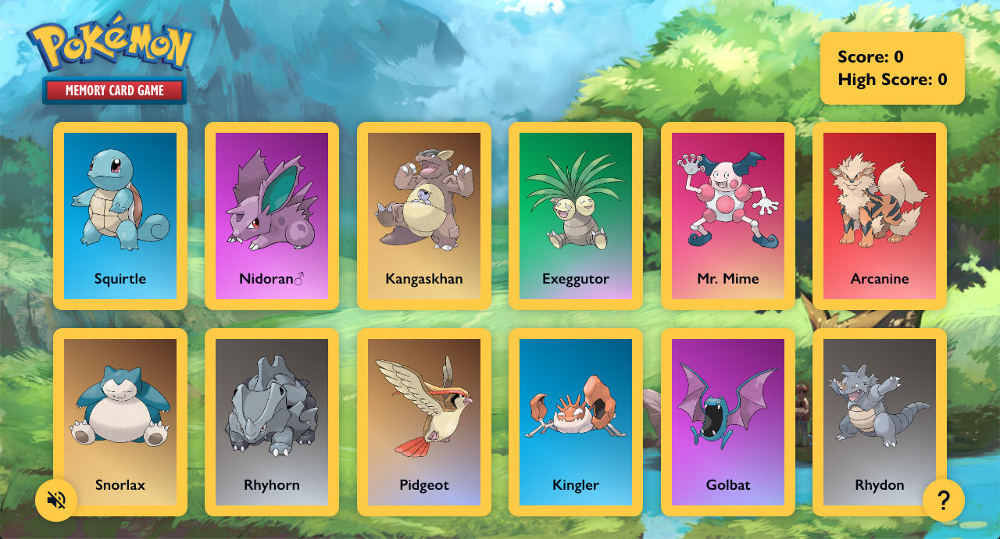

# Memory Card

A Pokémon memory card game – try to select all twelve cards without repeating yourself! If you select the same card twice, it's game over and you'll have the option to play again.

**[Click here to view the live site!](https://memory-card-ma.pages.dev/)**

## How to Play

1. [Head to the live site](https://memory-card-ma.pages.dev/) on any device (mobile, tablet, or desktop – it doesn't matter)
1. Click on each Pokémon card once (and only once!)
1. If you're on desktop, enjoy the dynamic card animations as you hover over and select them. Nice!
1. Try to select all twelve cards without any duplications, or else you'll have to start over
1. Once you've caught all twelve, you win!
1. Click on the `?` icon if you need to review the instructions
1. Click on the sound icon to enjoy some music while you play. Click on it again to pause the music.
1. Play again as many times as you like! Each time, twelve Pokémon of the original 151 are randomly selected for you. So you can enjoy the game's replay value not knowing what will come up next!

https://github.com/matthewaubert/memory-card/assets/132402803/7db32717-496b-41b3-896d-9b9533f3c1c8

## Project Objectives

This project was built in order to implement the React concepts I've learned thus far, including: components, JSX, keys, props, state, and effects. The main goal was to use hooks to manage and utilize state while fetching and using data from an external API.

I additionally decided to have even more fun with side effects and add some lively animations to the cards (using JavaScript and CSS in tandem), as shown in the video above. I has quite happy with the results and learned quite a bit. See the code at `src/components/Card.jsx`.

## Technologies Used

### Languages
- JavaScript
- CSS
- HTML

### Libraries and Tools
- React
- Vite – for project scaffolding and development
- Git (obviously)

## Credits

- Pokémon data: [PokéAPI](https://pokeapi.co/)
- International Pokémon logo: [Wikipedia Commons](https://en.m.wikipedia.org/wiki/File:International_Pok%C3%A9mon_logo.svg)
- Pokémon card background: [AtomicmonkeyTCG on DeviantArt](https://www.deviantart.com/atomicmonkeytcg/art/Pokemon-Card-Backside-in-High-Resolution-633406210)
- Landscape background: [Mizudokei on DeviantArt](https://www.deviantart.com/mizudokei/art/Twitch-Plays-Pokemon-440694759)
- Background music: [GlitchxCity](https://www.youtube.com/watch?v=m1vtEX64gmE&ab_channel=GlitchxCity)
- Poké Ball favicon: [Wikipedia Commons](https://en.m.wikipedia.org/wiki/File:Pok%C3%A9_Ball_icon.svg)
