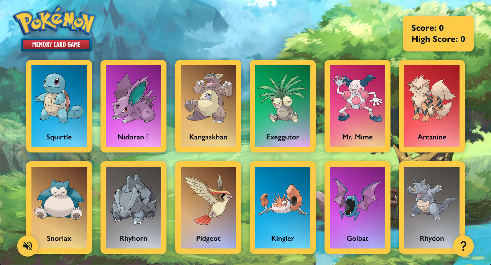

# Memory Card

**[Click here to view the live site!](https://memory-card-ma.pages.dev/)**

## How to Play

1. [Head to the live site](https://memory-card-ma.pages.dev/) on any device (mobile, tablet, or desktop - it doesn't matter)
1. Click on each Pokémon card once (and only once!)
1. If you're on desktop, enjoy the dynamic card animations as you hover over and select them. Nice!
1. Try to select all twelve cards without any duplications, or else you'll have to start over
1. Once you've caught all twelve, you win!
1. Click on the `?` icon if you need to review the instructions
1. Click on the sound icon to enjoy some music while you play
1. Play again as many times as you like! Each time, twelve Pokémon of the original 151 are randomly selected for you. So you can enjoy the game's replay value not knowing what will come up next!

https://github.com/matthewaubert/memory-card/assets/132402803/7db32717-496b-41b3-896d-9b9533f3c1c8

## About This Project

This project was built as part of [The Odin Project: React course](https://www.theodinproject.com/lessons/node-path-react-new-memory-card) in order to implement the React concepts I've learned thus far, including: components, JSX, keys, props, state, and effects. The main goal was to use hooks to manage and utilize state while fetching and using data from an external API.

I additionally decided to have even more fun with side effects and add some lively animations to the cards (using JavaScript and CSS in tandem), as shown in the video above. I has quite happy with the results. See the code at `src/components/Card.jsx`!

Read on for more on my approach to this project.

## Understanding the Problem

Create a memory card game, with similar functionality to [this student's solution](https://heldersrvio.github.io/memory-card-game/).

My app should include the following:
- A scoreboard, which counts the highest score
- A "Best Score", which shows the highest score the user has achieved thus far
- A function that displays the cards in random order anytime a user clicks one
- A handful of cards that display images and possibly informational text. These cards and texts need to be fetched from an external API.

## Plan

1. [Create a new React project](https://gist.github.com/matthewaubert/e809ae8ccfe41442bb588b3c49d9c63d)

1. Features I want to implement:
   - Cards in the center of the screen. They should rotate dynamically when the user hovers over them and flip around when clicked.
   - A scoreboard to record the current score and high score
   - Save the high score to the browser's localStorage
   - Instructions or a help menu
   - An interesting background (perhaps a moving gif?)
   - Music and/or sound effects
   <!-- - Different difficulty levels? (e.g. easy, medium, hard) -->

1. Components I'll need:
   - Card
   - StartScreen
   - Scoreboard
   - MenuButton
   - HelpMenu (modal)

1. How to structure my application:
   - App (background image)
     - Header
       - Logo
       - Scoreboard
     - Main
       - Cards (fit to screen via CSS grid repeat fn)
     - Footer
       - MenuButton (sound)
       - MenuButton (help)

1. How to get the images from an API:
   - I will use [PokéAPI](https://pokeapi.co/)
   - Based on the documentation, I can make a fetch request to `https://pokeapi.co/api/v2/pokemon/{name or id}`
   - I can then make use of the `name`, `types`, and `sprites` properties in the resulting JSON object

## Credits

- Pokémon data: [PokéAPI](https://pokeapi.co/)
- International Pokémon logo: [Wikipedia Commons](https://en.m.wikipedia.org/wiki/File:International_Pok%C3%A9mon_logo.svg)
- Pokémon card background: [AtomicmonkeyTCG on DeviantArt](https://www.deviantart.com/atomicmonkeytcg/art/Pokemon-Card-Backside-in-High-Resolution-633406210)
- Landscape background: [Mizudokei on DeviantArt](https://www.deviantart.com/mizudokei/art/Twitch-Plays-Pokemon-440694759)
- Background music: [GlitchxCity](https://www.youtube.com/watch?v=m1vtEX64gmE&ab_channel=GlitchxCity)
- Poké Ball favicon: [Wikipedia Commons](https://en.m.wikipedia.org/wiki/File:Pok%C3%A9_Ball_icon.svg)
